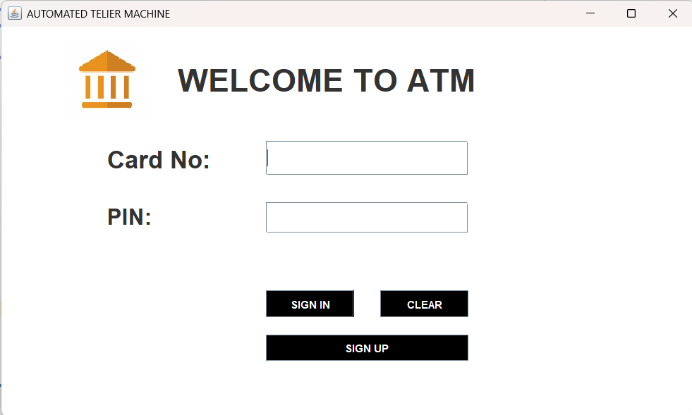
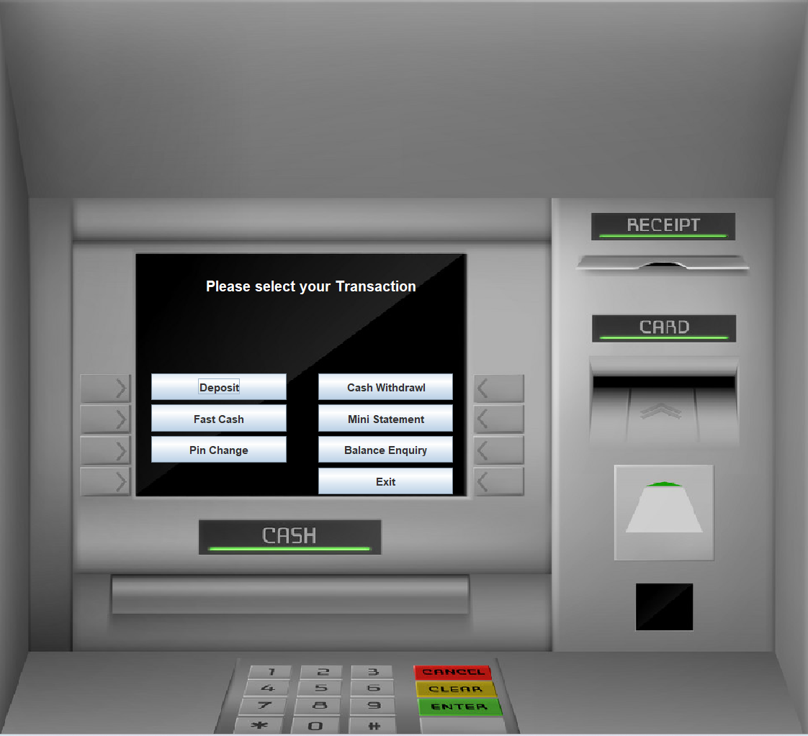
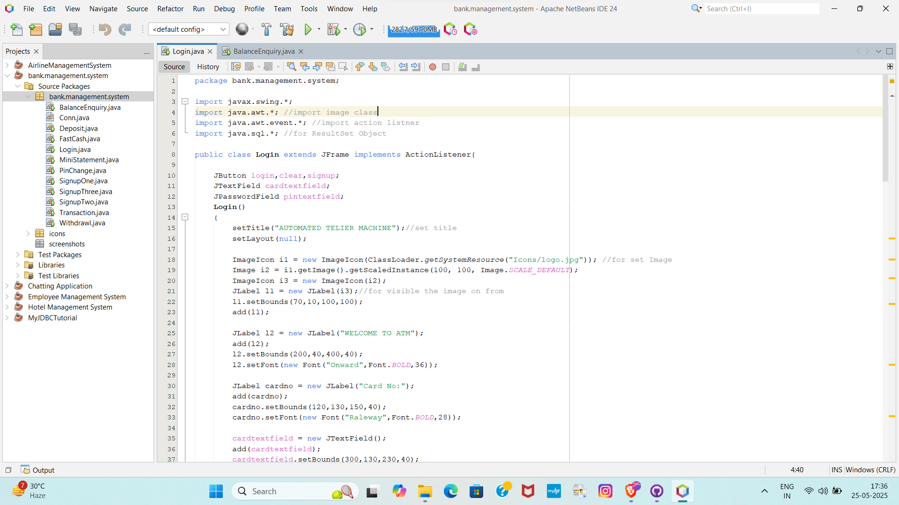

# Bank Management System 💳

A Java Swing-based desktop application for managing basic banking operations like account creation, login, deposits, withdrawals, and transaction history.

## 📸 Screenshots

### 🔐 Login Screen

### 🧑‍💼 Dashboard

### 🧑‍💻 NetBeans Code View

## 🛠️ Tech Stack

- **Language:** Java
- **GUI:** Swing (Java AWT & Swing)
- **Database:** MySQL
- **IDE:** Apache NetBeans

## 🚀 Features

- User Signup with multiple steps
- Secure Login
- Deposit, Withdraw, and Transaction functionality
- Balance Enquiry
- Mini Statement display
- Pin Change option
- Custom icons and design
| Technology | Purpose |
|------------|---------|
| Java       | Core programming |
| Swing      | GUI (Graphical User Interface) |
| JDBC       | Database connectivity |
| NetBeans   | IDE used for development |

## 📂 Project Structure

bank.management.system/
├── src/
│ └── bank/management/system/
│ ├── *.java
│ ├── icons/
│ └── Screenshot/
│ ├── login_screen.png
│ ├── dashboard_screen.png
│ └── netbeans_code.png
├── README.md
├── build.xml
├── manifest.mf

## ✅ How to Run

1. Open the project in **Apache NetBeans**.
2. Ensure your **MySQL server** is running.
3. Set up the database using the provided SQL scripts.
4. Click **Run Project** (Shift + F6).

## 🔒 Login Credentials

- **Default Username:** `admin`
- **Password:** `admin@123`
> *You can change this in the database or during signup.*

---

## 🤝 Author

**Sk Mustak Ahammed**  
Aspiring Java Developer  

📧 [skjewel9593@gmail.com] | 🌐 [LinkedIn:www.linkedin.com/in/sk-mustak-ahammed-75a617246]

---

## 📌 Notes

- This project is for learning purposes.
- You can enhance this further using **Spring Boot**, **JPA**, or **JavaFX** for better UI.

---

### This project is licensed under the MIT License – see the LICENSE file for details.
MIT License

#Copyright (c) 2025 Sk Mustak Ahammed

Permission is hereby granted, free of charge, to any person obtaining a copy
of this software and associated documentation files (the "Software"), to deal
in the Software without restriction, including without limitation the rights
to use, copy, modify, merge, publish, distribute, sublicense, and/or sell
copies of the Software, and to permit persons to whom the Software is
furnished to do so, subject to the following conditions:

The above copyright notice and this permission notice shall be included in all
copies or substantial portions of the Software.

THE SOFTWARE IS PROVIDED "AS IS", WITHOUT WARRANTY OF ANY KIND, EXPRESS OR
IMPLIED, INCLUDING BUT NOT LIMITED TO THE WARRANTIES OF MERCHANTABILITY,
FITNESS FOR A PARTICULAR PURPOSE AND NONINFRINGEMENT. IN NO EVENT SHALL THE
AUTHORS OR COPYRIGHT HOLDERS BE LIABLE FOR ANY CLAIM, DAMAGES OR OTHER
LIABILITY, WHETHER IN AN ACTION OF CONTRACT, TORT OR OTHERWISE, ARISING FROM,
OUT OF OR IN CONNECTION WITH THE SOFTWARE OR THE USE OR OTHER DEALINGS IN THE
SOFTWARE.

